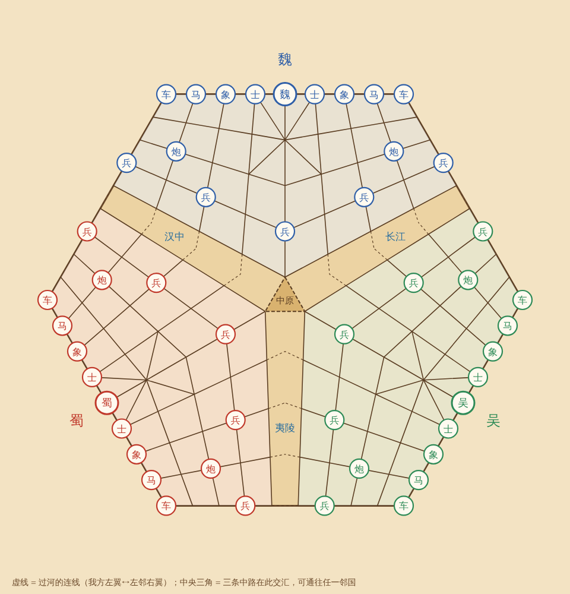

# 三国象棋 · 鼎立盘

魏、吴、蜀三人对弈的中国象棋变体。三家的标准半盘拼成一个六边形，每家的左翼隔河对着左邻国、右翼对着右邻国，三条中路在棋盘中心的"中原"三角交汇。

**在线试玩：** https://liukaidipeng-ops.github.io/sanguo-xiangqi/

## 怎么和朋友联机

1. 打开网址，在右侧"联机对战"里选好自己执哪一国，点"创建房间"。
2. 点"复制邀请链接"发给两位朋友，或者直接告诉他们 4 位房间号。
3. 朋友打开链接就会自动进入房间，按加入顺序坐到空着的国家，不需要注册账号。
4. 人不够时，房主可以把空座位设成 AI。座位被 AI 占了以后，再进来的人只能观战。

三台设备是直接连接的，房主的页面要一直开着。刷新或断线以后，点"回到房间"可以回到原来的座位。少数网络（比如部分公司 Wi-Fi）不支持直连，连不上时可以换成手机流量再试。

轮到你走棋时，你这一方的地盘和棋盘边框会呼吸闪烁，浏览器标签页标题也会显示"轮到你了"。

## 看清每一步

- 选中棋子后，每个能走的方向会出现一条带流动箭头的浅色通道，箭头指向落点，能吃的子会套上圈。车、炮沿实际路线画（穿过中原会拐弯），马、象直接连到落点。
- 棋子会沿着实际路线滑过去，车炮穿过中原时会跟着拐弯；被吃的子会被撞飞，同时有落子和吃子音效（右侧可以关）。
- 棋盘上用三家的颜色画出最近一轮每家走的路线，越早的越淡。
- 轮到你时可以点"回看上一轮"，把上一轮三步重新播一遍。
- 每家的卡片下面列出它吃掉的棋子；红色虚线和红圈表示哪个子正在威胁哪家的帅。

## 规则要点

- 走法和开局摆法与普通象棋相同。中路冲到河口后进入中原三角，可以选择攻向任意一家。马不能绕过中原三角跳。
- 不判"将死"：帅被吃掉才出局。飞将规则保留。
- 吃掉帅的一方得到对方剩下的车、马、炮、兵，仕和象被移除。
- 50 回合没有吃子就终局，按吃子分排名：车 9，炮 4.5，马 4，仕和象 2，过河兵 2，未过河兵 1，吃帅另加 10。
- 每开新一局，先手轮换给下一家。

完整设计见 [docs/设计方案.md](docs/设计方案.md)。规则是用 AI 自对弈 1600 局调出来的，数据见 [docs/测试报告.md](docs/测试报告.md)。

## 文件说明

- `index.html`：整个游戏，包括规则引擎、AI、界面和联机，都在这一个文件里。
- `peerjs.min.js`：联机用的 [PeerJS](https://peerjs.com/) 1.5.4（MIT 许可，见 `peerjs.LICENSE`）。
- `sim/`：规则模拟器。`node sim/test.js` 运行规则校验，`node sim/sim.js absorb-score 20 1 3 > out.jsonl` 跑自对弈，`node sim/analyze.js out.jsonl` 出统计。

## 已知限制

- 联机靠 PeerJS 的免费公共服务器牵线，偶尔会连不上，重试一下或换个网络。
- 房主的浏览器是裁判，房主离开后对局会暂停，房主回到房间后可以继续。
- AI 只看子力和吃子分，不会结盟，水平一般。
